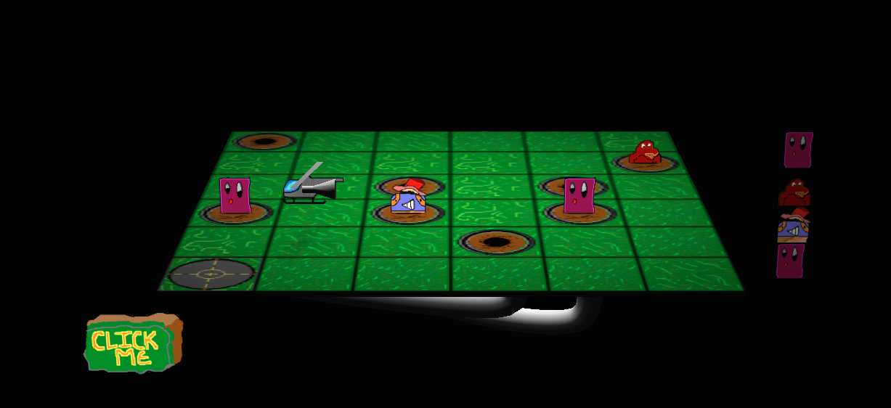

ld29
====

Ludum Dare #29 April 2014 "Below The Surface"

You are the pilot of a low-tech Suction Chopper. Click on a gopher hole to position your helicopter and vacuum up the critter at the other end. Advance to the next level by extracting the critters in the specified order. It takes a special kind of genius to know which hole leads where, so take a peek below the surface and apply your memory. You only get three peeks, so be a savant.

There is no programmed ending, but eventually toe game will become too difficult to play (for either you or your hardware).

Play here: http://abrie.github.io/ld29
